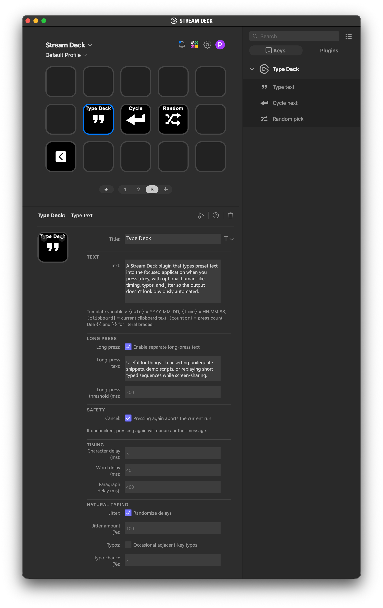

<p align="center">
  <picture>
    <source media="(prefers-color-scheme: dark)" srcset="docs/logo-dark.svg">
    
  </picture>
</p>

A [Stream Deck](https://www.elgato.com/stream-deck) plugin that types preset text into the focused application when you press a key, with optional human-like timing, typos, and jitter so the output doesn't look obviously automated.

Useful for things like inserting boilerplate snippets, demo scripts, prepared answers, or replaying short typed sequences while screen-sharing.

## Actions

| Action          | What it does                                                                                                   |
| --------------- | -------------------------------------------------------------------------------------------------------------- |
| **Type text**   | Types the configured text every press. (Optional: **long press** types a second, different string)             |
| **Cycle next**  | Each non-empty line of the text field is one entry. Each press types the next line, looping back to the start. |
| **Random pick** | Same line-per-entry format as Cycle next, but each press picks one at random.                                  |

## Features

- **Per-character, per-word and per-paragraph delays.** Tune typing speed to suit the receiving app or demo situation.
- **Jitter.** Randomize each delay by ±N % so the rhythm doesn't feel too robotic. Enabled by default at 100 %.
- **Adjacent-key typos.** Per-character chance of typing a wrong key, pausing, hitting backspace, and continuing. What could be more Human than errors?
- **Template variables.** Inline tokens are expanded at type-time:
  - `{date}` → `YYYY-MM-DD`
  - `{time}` → `HH:MM:SS`
  - `{clipboard}` → current clipboard contents
  - `{counter}` → number of presses (persisted per action)
  - Use `{{` and `}}` for literal braces.
- **Cancel or queue.** Pressing the key while it's already typing either aborts the current run (default) or queues another run to start immediately after, depending on the per-action setting.

<p align="center">
  
</p>

## Installation

Download the latest `com.ewels.type-deck.streamDeckPlugin` from the [Releases](https://github.com/ewels/type-deck/releases) page and double-click it — Stream Deck will install the plugin.

<!-- prettier-ignore-start -->
> [!NOTE]
> **macOS:** The plugin types via OS-level keyboard simulation, which may require granting Stream Deck **Accessibility** permission under _System Settings → Privacy & Security → Accessibility_.
<!-- prettier-ignore-end -->

## Development

Requires Node 24 and [@elgato/cli](https://github.com/elgatosf/cli) for the dev/install loop.

```sh
npm install
npm run watch   # rebuild on save + auto-restart the plugin
```

See [`CLAUDE.md`](./CLAUDE.md) for architecture notes.

## License and Credits

Released with the [MIT license](./LICENSE).

By Phil Ewels ([@ewels](https://github.com/ewels)).
